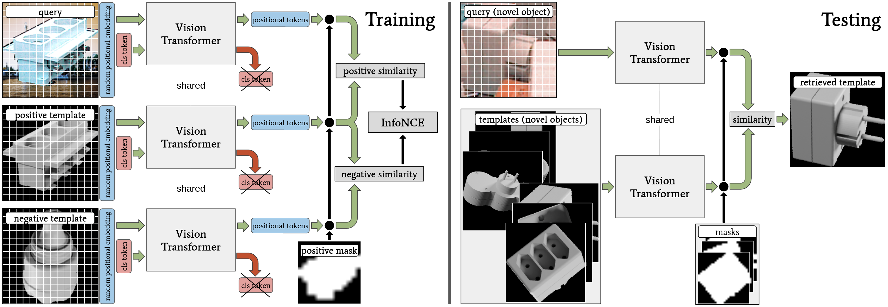

Pytorch implementation of [**"Self-supervised Vision Transformers for 3D Pose Estimation of Novel Objects"**](https://arxiv.org/abs/2203.17234)

**Stefan Thalhammer, Jean-Basptiste Weibel, Markus Vincze and Jose Garcia-Rodriguez**



If our project is helpful for your research, please consider citing : 
``` Bash
@misc{thalhammer2023selfsupervised,
      title={Self-supervised Vision Transformers for 3D Pose Estimation of Novel Objects}, 
      author={Stefan Thalhammer and Jean-Baptiste Weibel and Markus Vincze and Jose Garcia-Rodriguez},
      year={2023},
      eprint={2306.00129},
      archivePrefix={arXiv},
      primaryClass={cs.CV}
}
```
## Table of Content
* [Installation](#Installation)
* [Datasets](#Datasets)
* [Training and Visualization](#Training)
* [Acknowledgement](#Acknowledgement)

## Installation

Either setup an Anaconda environment:
```
conda env create -f environment.yml
conda activate template
```
or a Docker container. Please modify the paths in ''docker_launch.sh'' and run:
```
./docker_launch.sh
```
## Datasets 

Please refer to [this repo](https://nv-nguyen.github.io/template-pose/), or to [this branch](https://github.com/sThalham/TraM3D/tree/template_pose) for data retrieval.

## Training
#### 1. To launch a training on all Linemod splits:
```
./train_vit_LM_splits.sh
```
#### 2. To launch a training on T-LESS:
```
python train_tless.py --config_path ./config_run/TLESS.json
```
#### 3. To visualize the Self-attention for a specific image:
```
python vizualize_SA.py --config_path config_run/<config_file> --pretrained_weights <your_weights>.pth --image_path <image_to_visualize_SA>.png --mask_path <corresponding_template_mask.png  --output_dir <path_to_safe_SA> --threshold 0.75
```
## Acknowledgement

The code is adapted from [template-pose](https://nv-nguyen.github.io/template-pose/). 
Please also cite the original paper if the provided code is used: 
``` Bash
@inproceedings{nguyen2022template,
    title={Templates for 3D Object Pose Estimation Revisited: Generalization to New objects and Robustness to Occlusions},
    author={Nguyen, Van Nguyen and Hu, Yinlin and Xiao, Yang and Salzmann, Mathieu and Lepetit, Vincent},
    booktitle={Proceedings IEEE Conf. on Computer Vision and Pattern Recognition (CVPR)},
    year={2022}}
```